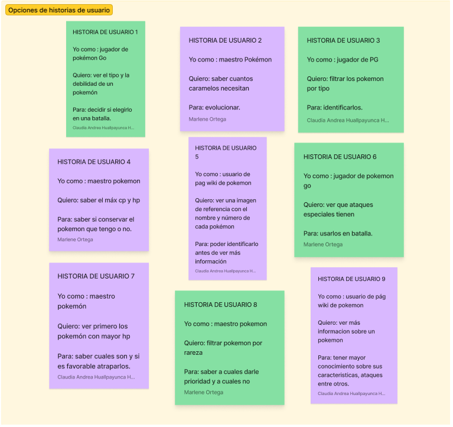
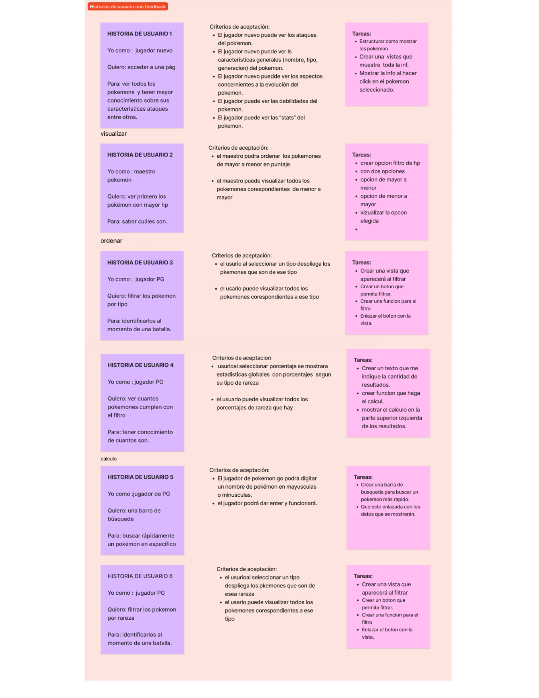
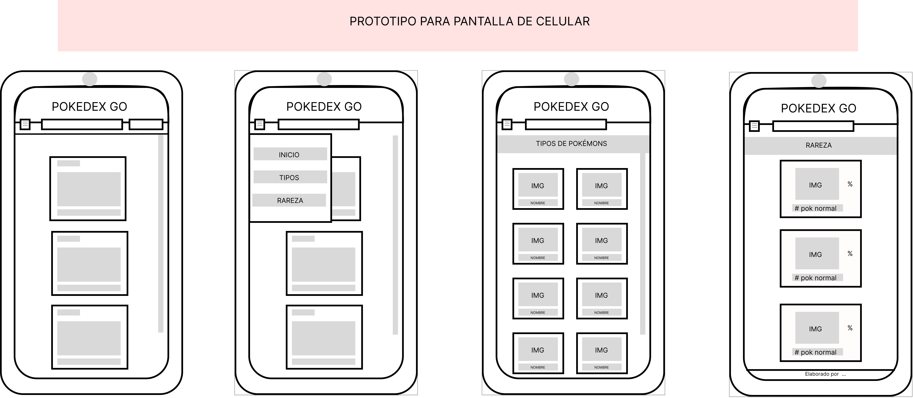
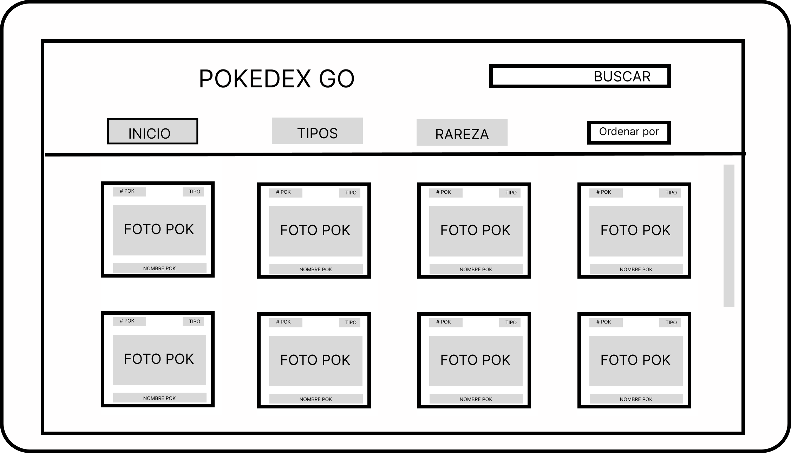
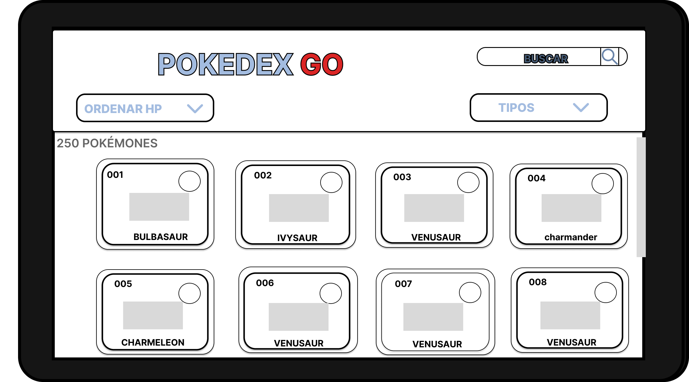
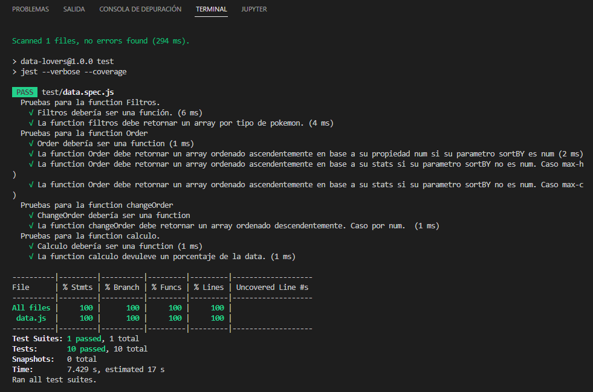

# Data Lovers

## Índice

* [1. Resumen del proyecto](#1-resumen-del-proyecto)
* [2. Objetivo de la página](#2-objetivo-de-la-pagina)
* [3. Planeación e historias de usuario](#3-Planeación-e-historias-de-usuario)
* [4. Criterios de aceptación mínimos del proyecto](#4-criterios-de-aceptación-mínimos-del-proyecto)
* [5. Diseño de la Interfaz de Usuario](#5-Diseño-de-la-Interfaz-de-Usuario)
* [6. Pruebas unitarias](#6-Pruebas-unitarias)
* [7. Resultado final](#7-Resultado-final)

***

## 1. Definición del producto

En este proyecto se construyó una pagina web para visualizar un conjunto de datos de Pokémon, con el objetivo de dar respuesta a las necesidades de los usuarios de obtener estos datos. 

En esta página web se permite visualizar los datos de manera ordenada y clasificada para que el usuario pueda entenderla y buscar lo que necesita, además  se puede filtrar por tipo de pokémon y hacer algunos cálculos como contar cuántos pokemon hay de cada tipo y ver su respectivo porcentaje en base al total.

## 2. Objetivo de la página 

Brindar información ordenada y puntual a maestros Pokemon , jugadores de pokemon Go  y público en general que desee buscar información de Pokemon.

## 3. Planeación e historias de usuario
El proyecto estaba  planificado con 4 sprints y se usó Trello para el manejo de las tareas y la organización de la busqueda de información.

Se realizó una investigación, se leyó la data proporcionada en el archivo Json y en base a ellos se concluyeron las siguientes historias de usuario que fueron divididas en las siguientes etapas:

Etapa 1 braindump,
En esta estapa realizamos todas las cosas que un usuario como maestro pokemon, como jugador de pokemon GO y como persona que busca informacion,podria necesitar .

Etapa 2 Eleccion.
En la etapa 2 se tomaron decisiones de las mejores historias de usuario o las más adecuadas para nuestro proyecto y quedaron de la siguiente forma:

Etapa 3 FeedBack

En esta etapa se pidio Feedback a un asesor donde nos oriento en la mejora y definición de las historias de una manera mas clara y puntual.

## 5. Diseño de la Interfaz de Usuario

#### Prototipo de baja fidelidad

En este proyecto se realizaron bocetos(sketches) de lo que se planeaba implementar, utilzando figma de una manera sencilla con el uso de líneas y palabras clave a manera de papel y lapiz virtual.
De los cuáles se obtuvieron las siguientes iteraciones en las diferentes pantallas (pantalla de celular y pantalla para Pc).(responsive)

Prototipo de baja fidelidad para celular:

Prototipo de baja fidelidad para PC:

Una vez elaborados las primeras alternativas, consultamos con compañeras  y couch de Laboratoria, obteniendo las siguientes sugerencias.

Feedback: 
* Que todos los botones tengan funcionalidad.
* Que sea fácilmente visible el input de buscar.
* Que los botones de filtros sean cercanos a la palma del usuario.

Al implementar las sugerencias, obtuvimos los siguientes prototipos de baja fidelidad.

Prototipo de baja fidelidad para celular:

Prototipo de baja fidelidad para PC:

#### Prototipo de alta fidelidad

En este apartado se encuentran los bocetos de alta fidelidad que seria lo ideal para nuestra página, siguiendo los fundamentos de visual design. Se muestran las diferentes pantallas de como se percibiría cada botón e interacción, además se incluye el link de Figma ya que el trabajo cuenta con un prototipo interactivo de como reaccionan los botones al darles click.

En las siguientes imágenes se muestran los prototipos de alta fidelidad.

Prototipo de alta fidelidad para celular:

Link de figma: https://www.figma.com/file/AqhQxBbkhkpQCAjEHUopiw/PROTOTIPO-DE-ALTA--CELULAR?node-id=0%3A1&t=SiiQT2Ecj4DC6sX6-1 

Prototipo de alta fidelidad para PC:

Link de figma: https://www.figma.com/file/NOEtt91nIOqkos7V5Ylym8/PROTOTIPO--ALTA-PC?node-id=2%3A5&t=NBKQK9XqjeyLmdEB-1

## 6. Pruebas unitarias
En este apartado mostramos las pruebas unitaras del proyecto.

## 7. Resultado final 

