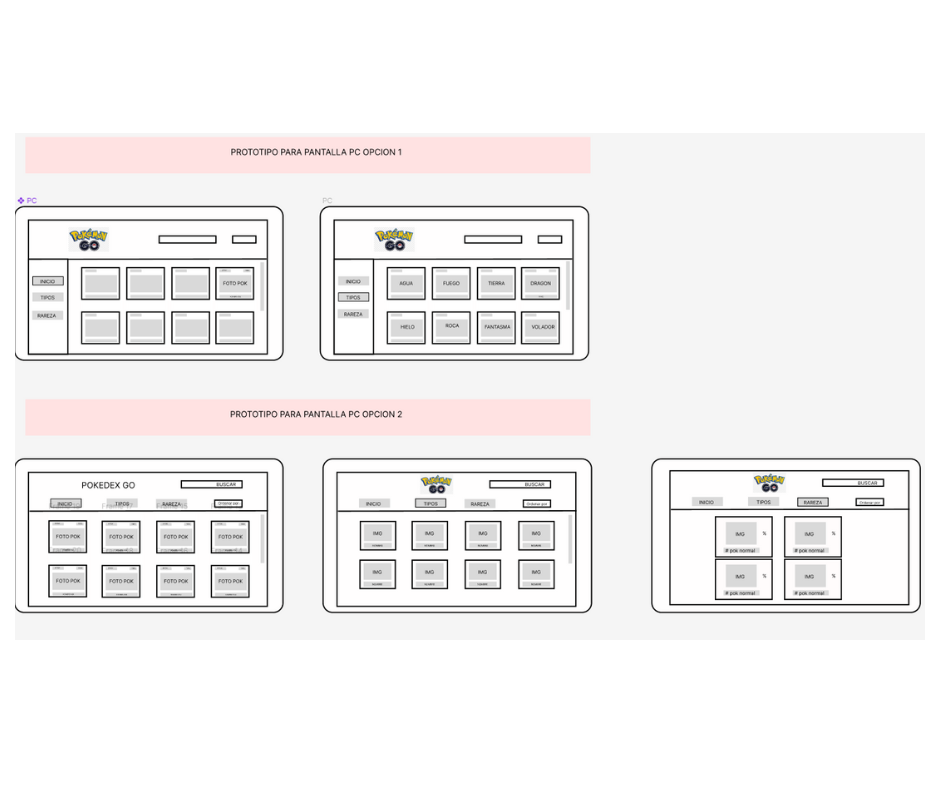

# Data Lovers

## Índice

* [1. Resumen del proyecto](#1-resumen-del-proyecto)
* [2. Objetivo de la pagina](#2-objetivo-de-la-pagina)
* [3. Planeación e historias de usuario](#3-Planeación-e-historias-de-usuario)
* [4. Criterios de aceptación mínimos del proyecto](#4-criterios-de-aceptación-mínimos-del-proyecto)
* [5. Hacker edition](#5-Diseño-de-la-Interfaz-de-Usuario)
* [6. Consideraciones técnicas](#6-Pruebas-unitarias)
* [7. Pistas, tips y lecturas complementarias](#7-Resultado-final)
* [8. Checklist](#8-checklist)

***

## 1. Definicion del producto

En este proyecto se construyo una pagina web para visualizar un conjunto de datos 
de Pokemon para dar respuesta a necesidaddes de usuarios de estos datos. 

En esta pagina web se permite visualizar los datos de manera ordenada y clasificada 
para que le usuario pueda entenderlay bscar lo que necesita , ademas tambien se
puede filtrar por tpo de pokemon y hacer algunos calculos como saber el mayo HP 
que son indispensables para quienes juegan Pokemon Go .

## 2. Objetivo de la pagina 

Brindar informacion oredenda y puntual a maestros Pokemon , jugadores de pokemon Go
 y publico en gernal que desde buscar informacion de Pokemon.

## 3. Planeación e historias de usuario
El proyecto estaba planificado con 4 sprints para lo cual se uso Trello
para manejar las tareas a realizar tales como la busqueda de informacion.

Se realizo una investigacion, se leyo la informacion dad en el archivo Json,
y en base a ellos se concluyeron las siguientes historias de usuario que 
fueron divididas en las siguientes etapas:

Etapa 1 braindump,
en esta estapa realizamos todas las cosas que un usuario como maestro pokemon, 
como jugador de pokemon GO y como persona que busca informacion,podria necesitar .

Etapa 2 Eleccion.
en la etapa 2 se tomaron decision de las mejores hisotrias de usuario o las mas 
adecuadas para nuestro proyecto.y quedaron de la siguiente forma:

Etapa 3 FeedBack

En esta etapa se pidio Feednack a un asesor donde nos oriento para mejorar
y definir de maneara mas clara ls hisotrias de usuario y quedaron de esta
forma que es la final.

## 5. Diseño de la Interfaz de Usuario

#### Prototipo de baja fidelidad

En este proyecto se realizaron bocetos(sketches ) de lo que se planeaba implemnetar ,
utilzando figma de una manear sencilla usando solo lineas y palabras ya que es un 
boceto de baja fidelidad,a manera de papel y lpaiz virtual donde como resultado obtuvimos
todas las siguientes iteraciones y diferentes pantallas tanto en modo de pantaa de celular
asi como para Pc.

#### Prototipo de alta fidelidad

En este apartado se encuntran los bocetos de alta fidelidad que seria lo ideal para
nuestra pagina ,siguendo los fundamentos de visual design.Se muestran las diferentes
pantallas de como se mostraria cada boton e interaccion , ademas se incluye el link de
Figma ya que el trabajo cuenta con interacion de como reacciona los botnes al darles click.

El _boilerplate_ de este proyecto no incluye Pruebas Unitarias (_tests_), así es
que  tendrás que escribirlas tú para las funciones encargadas de  _procesar_,
_filtrar_ y _ordenar_ la data, así como _calcular_ estadísticas.

Tus _pruebas unitarias_ deben dar una cobertura del 70% de _statements_
(_sentencias_), _functions_ (_funciones_), _lines_ (_líneas_), y _branches_
(_ramas_) del archivo `src/data.js` que contenga tus funciones y está detallado
en la sección de [Consideraciones técnicas](#srcdatajs).

## 6. Pruebas unitarias
En este apartado mostramos las pruebas unitaras del proyecto.

## 7. Resultado final 

## 8. Pistas, tips y lecturas complementarias

